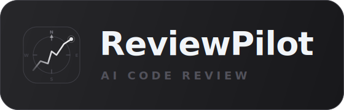

<p align="left">
  
</p>

# ReviewPilot 🧠🔍

ReviewPilot is a plugin for Codex Desktop that helps Codex do stronger code reviews.

- **Find real bugs.** Pushes reviews toward correctness, security, stale-state, contract, and workflow failures.
- **Review the right PRs first.** Triages open PRs so you spend deep review effort where it matters.
- **Use review budget better.** Starts with a strong first pass and only goes deeper when the risk justifies it.
- **Improve safely over time.** Learns from real GitHub review feedback through a safer probationary path.

## Why It Stands Out ✨

- **Deeper reviews.** Focuses on real bugs, not just style comments.
- **Smarter triage.** Ranks PRs as deep, quick, or skip.
- **Token-aware review.** Escalates only when needed and reuses cached runs when possible.
- **Safer learning loop.** Compares against real review feedback before promoting new lessons.

## Feature Highlights 🚀

- **PR Queue Triage:** Rank open PRs as `deep`, `quick`, or `skip` before spending full review budget.
- **Local Review Modes:** Review committed changes, dirty worktrees, or a broader repo surface.
- **Inline Findings And Repair Handoffs:** Produce review output that is easier to act on and easier to turn into fixes.
- **Review-Quality Comparison:** Compare your local review output against real GitHub review feedback to see what was missed.
- **Safe Learning And Automation:** Refresh lessons, harden the review brain, and keep the safer learning path behind the plugin.

## Docs At A Glance 📚

- [Plugin overview](plugins/codex-review/README.md)
- [Contributing](CONTRIBUTING.md)
- [GitHub MCP setup](docs/github-mcp-setup.md)
- [Lessons workflow](docs/lessons-workflow.md)
- [Architecture](docs/architecture.md)
- [Installed skill relationship](skill/README.md)

## Contribute 🤝

Want to help improve ReviewPilot?

- read [CONTRIBUTING.md](CONTRIBUTING.md)
- open an issue for bigger ideas
- send a pull request for focused fixes, docs, or review improvements

## Install 📦

Install ReviewPilot into **Codex Desktop** as a plugin:

```bash
npx --yes --package=@reviewpilot/codex-review-install -- codex-review-install
```

This is the normal public install flow. It installs the plugin into Codex and enables the bundled review skills.

Then restart **Codex Desktop**.

Manual fallback from a repo checkout or release bundle:

```powershell
powershell -ExecutionPolicy Bypass -File .\scripts\install_plugin_to_codex.ps1
```

If you are not sure which path to use:

- use the `npx` installer for the normal public install flow
- use the PowerShell script only if you are working from a local checkout or release bundle

## Quick Start ⚡

After install, the simplest way to use it is:

- ask Codex to use `$bug-hunting-code-review` when you want a review now
- ask Codex to use `$autonomous-review-cycle` when you want the wider review and learning workflow

If you want to run it directly:

```powershell
python .\plugins\codex-review\scripts\run_codex_review.py `
  --repo . `
  --mode changes `
  --depth deep `
  --base origin/main
```

That gives you:

- a review artifact
- benchmark output
- a repair plan
- inline review findings for Codex review cards

If you have several PRs open, triage them first:

```powershell
python .\plugins\codex-review\scripts\triage_pr_queue.py `
  --pr owner/name#123 `
  --pr owner/name#124
```

That writes a ranked queue under `artifacts/pr-triage/` and includes a suggested review command for each PR.

For more commands and workflow detail, use:

- [Plugin overview](plugins/codex-review/README.md)
- [GitHub MCP setup](docs/github-mcp-setup.md)
- [Lessons workflow](docs/lessons-workflow.md)
- [Architecture](docs/architecture.md)

## GitHub Learning Setup 🔌

If you want to use the GitHub learning flow, connect GitHub in Codex Desktop and then follow:

- [GitHub MCP setup](docs/github-mcp-setup.md)

That guide explains:

- what the plugin already ships in `.mcp.json`
- what you still need to connect in Codex
- how to capture GitHub MCP output
- how to feed that output into the learning pipeline

If you already have a queue of open PRs, the normal sequence is now:

1. triage the queue
2. spend `deep` reviews only on the risky PRs
3. use `quick` reviews for the smaller or lower-risk PRs
4. feed the best missed findings back through the gated learning flow

The fresh GitHub path is also the recommended quality-tuning loop. After you capture and normalize live review threads, compare them against a review artifact with:

```powershell
python .\plugins\codex-review\scripts\compare_review_quality.py `
  --review-file .\artifacts\github-intake\pipeline\<run>\review.md `
  --proposal .\artifacts\github-intake\pipeline\<run>\graphql-proposal.json `
  --candidates .\artifacts\github-intake\pipeline\<run>\graphql-candidates.json
```

That writes a plain-English summary plus a machine-readable comparison artifact you can feed back into later `run_codex_review.py --quality-comparison ...` runs.

For public-repo calibration work, you can also use:

```powershell
python .\plugins\codex-review\scripts\run_public_pr_quality_cycle.py `
  --repo owner/name `
  --pr 123 `
  --review-artifacts .\.codex-review
```

That path is comparison-only by default. It fetches public PR review feedback, normalizes it through the existing pipeline, and compares it against your local review artifact without writing directly into the learning corpus.

If you want the same public path to auto-learn safe misses into the probationary lane, use:

```powershell
python .\plugins\codex-review\scripts\run_public_pr_quality_cycle.py `
  --repo owner/name `
  --pr 123 `
  --review-artifacts .\.codex-review `
  --auto-learn-probationary
```

## Lessons Workflow 🧠

If you keep review lessons in an optional local lessons file, turn them into repo-local training input with:

```powershell
python .\plugins\codex-review\skills\bug-hunting-code-review\scripts\refresh_lessons_reference.py `
  --source C:\path\to\codex-lessons.md
```

That creates a local snapshot used to refresh the committed bug-pattern prompts.

Full instructions:

- [Lessons workflow](docs/lessons-workflow.md)

## Publish Readiness ✅

Before publishing, run:

```powershell
python .\scripts\validate_public_release.py
```

That checks:

- package metadata
- plugin metadata
- required public files
- Python script syntax

Release checklist:

- [Public release checklist](docs/public-release-checklist.md)

## More Docs 🔎

- [Project overview](docs/index.md)
- [Architecture](docs/architecture.md)
- [Plugin README](plugins/codex-review/README.md)
- [GitHub MCP setup](docs/github-mcp-setup.md)
- [Installed skill relationship](skill/README.md)
- [Lessons workflow](docs/lessons-workflow.md)
- [Public release checklist](docs/public-release-checklist.md)

## License

This repo is licensed under the MIT license. See [LICENSE](LICENSE).
