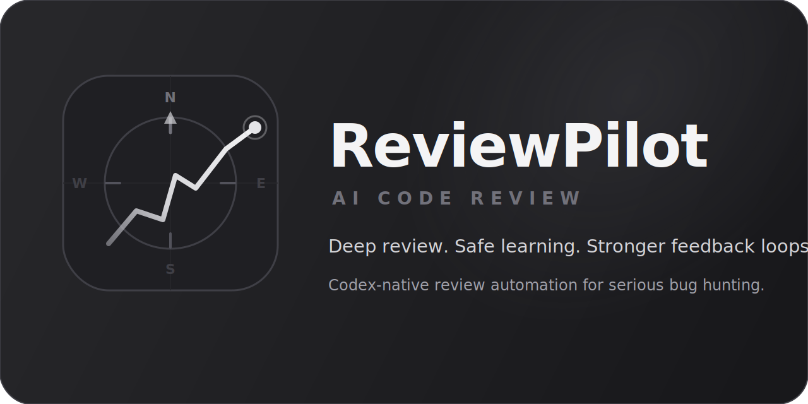

# ReviewPilot Plugin

This plugin is the primary container for the review system in this repo.

Its main purpose is to install ReviewPilot into Codex Desktop as a usable plugin, not just as a loose set of scripts.

Once installed, the plugin gives Codex a review-focused bundle that can:

- run local code reviews
- triage PR queues before spending full review budget
- compare review output against real GitHub review feedback
- support safer learning and repair workflows behind one plugin boundary

## Current Contents

- `.codex-plugin/plugin.json`
  Plugin manifest and user-facing metadata
- `skills/bug-hunting-code-review`
  The bundled deep review skill
- `skills/autonomous-review-cycle`
  Automation-facing orchestration skill that runs the plugin in a safe end-to-end sequence
- `.mcp.json`
  Plugin-owned MCP config. GitHub is now declared there as a read-only remote MCP boundary for live PR intake.
- `scripts/`
  Reserved for plugin-owned helper workflows as repo scripts migrate behind plugin boundaries

## What The Plugin Does Now

Today the plugin can:

- triage a queue of open PRs before spending full review budget
- run local reviews with explicit `quick` and `deep` depth controls
- escalate from a strong first pass only when the scan says more depth is worth paying for
- compare local review output against real GitHub review feedback
- learn cautiously into a probationary corpus instead of writing raw misses straight into the main corpus
- reuse cached triage and completed review artifacts when the relevant SHA and settings have not changed

## Current Boundary

Today, the plugin contains the maintained skill source, but the live runtime path is still the installed direct skill under:

- `~/.codex/skills/bug-hunting-code-review`

That direct skill runtime is currently updated with `scripts/sync_skill_to_codex.ps1`.

For Codex Desktop to discover the **plugin bundle itself**, the repo plugin should also be installed into a local Codex marketplace.

The repo now includes a helper for that:

```powershell
powershell -ExecutionPolicy Bypass -File .\scripts\install_plugin_to_codex.ps1
```

That helper:

- copies `plugins/codex-review` into `~/.codex/local-marketplaces/<marketplace-name>/plugins/codex-review`
- also copies the installed plugin into `~/.codex/plugins/cache/<marketplace-name>/codex-review`
- writes `.agents/plugins/marketplace.json` inside that marketplace root
- marks the plugin as `INSTALLED_BY_DEFAULT` in that marketplace manifest
- registers `[marketplaces.<marketplace-name>]` in `~/.codex/config.toml`
- enables `[plugins."codex-review@<marketplace-name>"]` in `~/.codex/config.toml`
- makes the plugin discoverable to Codex Desktop as a local plugin bundle

After running it, restart Codex Desktop so the app reloads marketplace and plugin state.

So the practical setup today is:

- install the plugin bundle with `install_plugin_to_codex.ps1`
- optionally sync the direct installed runtime skill with `sync_skill_to_codex.ps1`

For public distribution, the intended path is the npm installer:

```bash
npx --yes --package=@reviewpilot/codex-review-install -- codex-review-install
```

That should be the main user-facing install flow.

It is the easiest way to install ReviewPilot into Codex Desktop as a plugin.

It still lands the plugin in Codex Desktop's marketplace path under the hood, but it removes most of the manual setup from the user's point of view.

Use that full command on Windows. It avoids a command-resolution problem with the shorter `npx @reviewpilot/codex-review-install` form.

The repo now includes:

```powershell
powershell -ExecutionPolicy Bypass -File .\scripts\build_plugin_release_bundle.ps1
```

That builds a release folder plus zip under `artifacts/release-bundles/` containing:

- `plugins/codex-review`
- `scripts/install_plugin_to_codex.ps1`
- `scripts/install_plugin_to_codex.mjs`
- `scripts/sync_skill_to_codex.ps1`
- `README-INSTALL.md`

It also builds an npm tarball via `npm pack` into the same output folder.

The zip installer remains the fallback path for people who want a manual install or are working from a source checkout.

## Intended Direction

The plugin should be the clean integration boundary for:

- GitHub PR review intake
- corpus and benchmark scoring workflows
- post-sync verification
- future MCP-backed or app-backed review operations

The bundled skill remains the review brain inside that plugin.

The current project roadmap is documented at:

- `docs/roadmap.md`

The GitHub intake design plan is still documented at:

- `docs/github-intake-plan.md`

The normalized proposal schema for the first GitHub intake workflow is documented at:

- `docs/github-intake-schema.md`

The first proposal-only intake script lives at:

- `plugins/codex-review/scripts/ingest_github_review_feedback.py`

The Codex-side MCP capture helper lives at:

- `plugins/codex-review/scripts/capture_github_mcp_feedback.py`

If you are setting this up for the first time, read:

- `docs/github-mcp-setup.md`

The legacy `gh`-based live GitHub fetch script lives at:

- `plugins/codex-review/scripts/fetch_github_review_feedback.py`

The wrapper entrypoint for the full live intake flow now lives at:

- `plugins/codex-review/scripts/run_github_intake_pipeline.py`

The plugin-owned review runner now lives at:

- `plugins/codex-review/scripts/run_automation_cycle.py`
- `plugins/codex-review/scripts/run_codex_review.py`
- `plugins/codex-review/scripts/triage_pr_queue.py`
- `plugins/codex-review/scripts/compare_review_quality.py`
- `plugins/codex-review/scripts/run_public_pr_quality_cycle.py`
- `plugins/codex-review/scripts/approve_quality_learning_candidates.py`
- `plugins/codex-review/scripts/propose_review_repairs.py`
- `plugins/codex-review/scripts/run_review_fix.py`
- `plugins/codex-review/scripts/emit_inline_review_comments.py`

The practical review flow is now:

1. `triage_pr_queue.py` to rank PRs as `deep`, `quick`, or `skip`
2. `run_codex_review.py` to run the suggested review depth
3. inspect `review-run-summary.json` to see what review strategy actually ran
4. `compare_review_quality.py` to measure what the review still missed when live feedback exists
5. `approve_quality_learning_candidates.py` if you want to move safe misses into the probationary lane
6. `run_review_fix.py` when you want a bounded repair handoff from one finding

Each review run now also produces:

- `review-run-summary.json`
- `review-run-summary.md`
- `inline-findings.json`
- `codex-inline-comments.txt`

Those artifacts are meant to back Codex inline review cards and evaluation, not just the plain `review.md` artifact.

The run summary is the stable per-run evidence file. It records:

- requested depth versus the effective review strategy
- selected passes, skipped passes, and why
- cache reuse versus a fresh run
- benchmark completion when present
- linked quality-comparison input when present

The review runner is also safer and cheaper than the earlier fixed multi-pass shape:

- deep review starts with one strong pass first
- follow-up passes only run when the first pass looks weak for the detected risk
- later pass timeouts no longer throw away an earlier useful review
- completed review runs can be reused when the repo head and review settings still match
- triage output now includes a stable decision summary so the `deep` vs `quick` choice is easier to trust and audit

For local skill improvement from an optional local lessons log, use:

```powershell
python .\plugins\codex-review\skills\bug-hunting-code-review\scripts\refresh_lessons_reference.py `
  --source C:\path\to\codex-lessons.md
```

That produces a repo-local snapshot at:

- `plugins/codex-review/skills/bug-hunting-code-review/references/local-lessons-snapshot.md`

Use that generated snapshot as input when curating:

- `plugins/codex-review/skills/bug-hunting-code-review/references/bug-patterns-from-lessons.md`

Suggested lesson-entry shape for the source file:

```md
### YYYY-MM-DD
- Context:
- Mistake or correction:
- What changed:
- Prevention for next time:
```

Keep the source lessons file focused on repeated review mistakes, durable bug patterns, and corrections that should change future review behavior.

Safety notes for the live fetch step:

- raw fetched review artifacts may contain private review content for private repos
- the preferred live GitHub path is the plugin MCP boundary in `.mcp.json`, not ambient `gh` auth
- `.mcp.json` pins GitHub to remote MCP, read-only mode, and the `pull_requests` toolset only
- GitHub access is read-only in both supported live paths: the MCP boundary is configured read-only, and the legacy `gh` path issues comment/thread reads only
- the default output path stays under ignored `artifacts/github-intake/`
- the fetch script refuses to write outside that tree unless explicitly overridden for local output
- the proposal normalizer follows the same default output boundary
- `--allow-outside-artifacts` is an unsafe local-write escape hatch only; it does not enable any GitHub write behavior
- when `--review-run-dir` points outside the ignored artifacts tree, that same local-write override must be passed explicitly; the wrapper no longer weakens this boundary implicitly
- the wrapper no longer defaults to the `gh` fetch path; `gh` is now an explicit legacy fallback behind `--use-gh-legacy-fetch`

The non-destructive review-mapping script lives at:

- `plugins/codex-review/scripts/propose_corpus_updates.py`

The candidate-quality gate now lives at:

- `plugins/codex-review/scripts/score_candidate_quality.py`

The reviewed promotion script now lives at:

- `plugins/codex-review/scripts/promote_corpus_candidates.py`

That script exists to turn selected reviewed candidates into auto-eligible candidates without weakening the default intake heuristics.

The probationary-to-primary promotion gate now lives at:

- `plugins/codex-review/scripts/promote_probationary_cases.py`

That script exists to promote cases out of the probationary lane only when repeated review artifacts support the same case strongly enough to treat it as durable primary-corpus knowledge.

The corpus apply script now lives at:

- `plugins/codex-review/scripts/apply_corpus_updates.py`

The current learning policy is intentionally two-lane:

- gate-approved GitHub-derived cases can auto-apply into the probationary corpus
- the primary GitHub corpus should stay harder to change and should not be treated as the raw output lane for fresh PR feedback

The current durable-promotion rule is also intentionally evidence-based:

- probationary cases should move into the primary corpus only after repeated review artifacts hit the same case
- exact duplicates and conflicting IDs fail closed
- near-duplicate primary matches stay out of `auto` and require explicit force if you really want them

The wrapper now defaults `--apply-target` to `probationary` so the safer lane is the default behavior, not an extra flag the caller has to remember.

The external SWE-bench lane is the hardening lane for broader review pressure. It helps the review brain improve without depending only on one team's historical PR misses, but it should not auto-write directly into the GitHub-derived corpus lanes.

If you have many live PRs, start with:

```powershell
python .\plugins\codex-review\scripts\triage_pr_queue.py `
  --pr owner/name#123 `
  --pr owner/name#124
```

That produces a ranked queue under `artifacts/pr-triage/` and now emits a recommended review command for each PR so you can keep the expensive path focused on the right work.

Recommended entrypoint for normal use:

```powershell
python .\plugins\codex-review\scripts\run_github_intake_pipeline.py `
  --repo owner/name `
  --pr 123 `
  --raw-input .\artifacts\github-intake\mcp\pr-123-comments.json `
  --raw-format github_mcp_pr_comments `
  --apply-mode review
```

That wrapper runs:

- normalize imported raw input
- ingest
- propose
- optional candidate-quality gate
- optional promote
- apply
- optional probationary-to-primary promotion when you ask for it explicitly

For the actual review-authoring path, use:

```powershell
python .\plugins\codex-review\scripts\run_codex_review.py `
  --repo . `
  --mode changes `
  --depth deep `
  --base origin/main
```

That command:

- prepares the review prompt, diff, metadata, and surface scan
- supports explicit review surfaces:
  - `changes`: committed diff vs base branch
  - `dirty`: local dirty worktree changes, including untracked text files
  - `full`: broader repo-scan mode where the diff is only one clue
- supports explicit review depth:
  - `quick`: lighter prompt and no benchmark step
  - `deep`: fuller prompt package plus benchmark step
- starts with a strong changed-hunks pass and only escalates if more depth is justified
- supports timeouts and reuse so stalled later passes or repeated reruns do not waste as much review budget
- invokes Codex non-interactively in read-only mode
- writes `review.md`
- writes `repair-plan.json` and `repair-plan.md` next to the review artifact
- writes `inline-findings.json` for Codex inline review-card rendering
- writes Codex stdout and stderr logs for inspection
- benchmarks the resulting review against the configured lanes when depth is `deep`
- automatically retries once in the same read-only sandbox if review generation fails mechanically or produces a missing or empty `review.md`

Examples:

```powershell
python .\plugins\codex-review\scripts\run_codex_review.py `
  --repo . `
  --mode dirty `
  --depth quick
```

```powershell
python .\plugins\codex-review\scripts\run_codex_review.py `
  --repo . `
  --mode full `
  --depth quick `
  --prepare-only
```

If you have a fresh quality-comparison artifact from live GitHub intake, you can feed it back into the prompt:

```powershell
python .\plugins\codex-review\scripts\run_codex_review.py `
  --repo . `
  --mode changes `
  --depth deep `
  --base origin/main `
  --quality-comparison .\artifacts\review-quality\<run>\quality-comparison.json
```

For an automation-oriented end-to-end local cycle, use:

```powershell
python .\plugins\codex-review\scripts\run_automation_cycle.py --repo .
```

That wrapper:

- runs the local review
- prepares the one-finding repair handoff
- optionally runs GitHub intake if a captured raw artifact is supplied
- can compare the finished review against fresh GitHub findings automatically
- can auto-learn comparison-approved corpus-gap misses into the probationary lane
- runs a small Hugging Face hardening batch
- writes `automation-summary.json` under `artifacts/automation-runs/`

By default the automation wrapper now passes `gpt-5.4-mini` to the model-backed steps so the cheap path is the default.

The automation wrapper can also stage lessons and drive more of the GitHub intake settings directly now.

Example:

```powershell
python .\plugins\codex-review\scripts\run_automation_cycle.py `
  --repo . `
  --lessons-source C:\path\to\codex-lessons.md `
  --github-repo owner/name `
  --github-pr 123 `
  --github-raw-input .\artifacts\github-intake\mcp\pr-123-comments.json `
  --github-apply-mode auto `
  --github-apply-target probationary `
  --github-promote-probationary-id feature-gates-preserve-existing
```

That keeps the main workflow in one entrypoint instead of requiring separate manual steps for lessons staging or promotion flags.

The intended user-facing flow is:

- use `$bug-hunting-code-review` for one-off reviews in Codex
- use `$autonomous-review-cycle` for recurring automation and GitHub learning

The scripts are the implementation layer behind those skills, not the primary product surface.

If Codex needs the inline review directives directly, render them from a completed run with:

```powershell
python .\plugins\codex-review\scripts\emit_inline_review_comments.py `
  --review-dir .\.codex-review\<run>
```

Most review runs should not need that extra step anymore, because the run now also writes `codex-inline-comments.txt` next to the review artifact.

For review-quality tuning against fresh GitHub feedback, capture live GitHub MCP review threads, normalize them through the existing intake pipeline, then compare them directly against a review artifact:

```powershell
python .\plugins\codex-review\scripts\compare_review_quality.py `
  --review-file .\artifacts\github-intake\pipeline\binder-pr-8-gated-live\binder-pr-8-codex-review.md `
  --proposal .\artifacts\github-intake\pipeline\binder-pr-8-gated-live\graphql-proposal.json `
  --candidates .\artifacts\github-intake\pipeline\binder-pr-8-gated-live\graphql-candidates.json
```

That comparison writes:

- `quality-comparison.json` with caught vs missed findings
- `quality-comparison.md` with a plain-English summary
- `prompt_focus` hints that can be fed back into `run_codex_review.py --quality-comparison ...`

For public-repo calibration, use:

```powershell
python .\plugins\codex-review\scripts\run_public_pr_quality_cycle.py `
  --repo owner/name `
  --pr 123 `
  --review-artifacts .\.codex-review
```

That wrapper:

- fetches public PR review feedback through the legacy read-only `gh` path
- runs the existing normalize -> propose flow without writing to the corpus lanes
- compares the public PR feedback against your local review artifact when one is supplied
- writes a compact summary plus comparison artifacts under `artifacts/public-pr-quality/`

Use only public repos for this path unless you have explicit permission to use a private repo's review content for calibration.

If you have many PRs and need to spend review budget selectively first, use:

```powershell
python .\plugins\codex-review\scripts\triage_pr_queue.py `
  --pr owner/name#123 `
  --pr owner/name#124
```

That wrapper:

- fetches only PR metadata and patch text through `gh`
- scores the PRs cheaply for review risk
- recommends `deep`, `quick`, or `skip`
- emits a suggested `run_codex_review.py` command with token-aware defaults for that PR
- writes a ranked queue under `artifacts/pr-triage/`

For Codex automations, the recommended skill entrypoint is:

- `plugins/codex-review/skills/autonomous-review-cycle/SKILL.md`

That keeps the plugin automation-friendly while leaving the actual review standard inside the bundled `bug-hunting-code-review` skill.

To turn one repair-plan finding into a bounded fix handoff:

```powershell
python .\plugins\codex-review\scripts\run_review_fix.py `
  --repo . `
  --repair-plan .\.codex-review\20260419-105149\repair-plan.json `
  --finding-index 1
```

That path:

- reads the structured `repair-plan.json`
- selects exactly one finding
- writes `selected-repair.json`, `fix-targets.txt`, and `fix-prompt.txt`
- defaults to prepare-only
- only attempts a Codex fix run when `--apply` is passed explicitly
- refuses `--apply` when the selected finding has no repo-local file targets

For MCP-native live intake, use the plugin's GitHub connector to capture one of these raw payload shapes first:

- PR comments timeline output compatible with `github_mcp_pr_comments`
- review-thread output compatible with `github_mcp_review_threads`

The user-facing GitHub connection steps are documented in:

- `docs/github-mcp-setup.md`

The intended Codex-side flow is:

1. use the GitHub connector to fetch either PR comments or review threads
2. write that tool output into a local raw artifact with `capture_github_mcp_feedback.py`
3. feed the captured artifact into `--raw-input`

Example capture step for PR comments:

```powershell
python .\plugins\codex-review\scripts\capture_github_mcp_feedback.py `
  --repo owner/name `
  --pr 123 `
  --kind pr_comments `
  --input .\artifacts\github-intake\mcp-tool-output.json
```

In Codex usage, the tool output file can be created by the agent automatically after the GitHub MCP call, so the user does not need to save connector output by hand.

To compare a real review output against the corpus before and after apply in the same run:

```powershell
python .\plugins\codex-review\scripts\run_github_intake_pipeline.py `
  --repo owner/name `
  --pr 123 `
  --raw-input .\artifacts\github-intake\mcp\pr-123-comments.json `
  --raw-format github_mcp_pr_comments `
  --apply-mode review `
  --score-review-file .\draft-review.md
```

That writes before, after, and delta benchmark artifacts into the same pipeline run directory.

To run the safer self-learning path into the probationary corpus:

```powershell
python .\plugins\codex-review\scripts\run_github_intake_pipeline.py `
  --repo owner/name `
  --pr 123 `
  --raw-input .\artifacts\github-intake\mcp\pr-123-comments.json `
  --raw-format github_mcp_pr_comments `
  --apply-target probationary `
  --gate-candidates `
  --score-review-file .\draft-review.md `
  --apply-mode auto
```

That path:

- gates candidates against duplicate checks and review-artifact evidence
- auto-applies only the gate-approved subset
- targets the probationary lane rather than the durable primary corpus

To promote a probationary case into the durable primary corpus:

```powershell
python .\plugins\codex-review\scripts\promote_probationary_cases.py `
  --ids feature-gates-preserve-existing `
  --review-file .\artifacts\review-a.md `
  --review-file .\artifacts\review-b.md
```

That path:

- requires repeated review-artifact evidence by default
- requires at least one strict expected-group match by default
- removes promoted cases from the probationary corpus
- appends them into the primary corpus only when the promotion gate clears

The wrapper can now drive that same durable promotion step in the same run directory:

```powershell
python .\plugins\codex-review\scripts\run_github_intake_pipeline.py `
  --repo owner/name `
  --pr 123 `
  --raw-input .\artifacts\github-intake\mcp\pr-123-comments.json `
  --raw-format github_mcp_pr_comments `
  --score-review-artifacts .\.codex-review `
  --gate-candidates `
  --apply-mode auto `
  --promote-probationary-ids feature-gates-preserve-existing
```

That keeps the normal safe intake path unchanged by default, but lets one wrapper run:

- learn into the probationary lane
- then evaluate selected probationary cases for durable promotion
- write a separate promotion result artifact in the same run folder

If the review was prepared through the bundled pre-PR helper, the wrapper can consume the prepared artifact directory directly:

```powershell
python .\plugins\codex-review\scripts\run_github_intake_pipeline.py `
  --repo owner/name `
  --pr 123 `
  --raw-input .\artifacts\github-intake\mcp\pr-123-comments.json `
  --raw-format github_mcp_pr_comments `
  --apply-mode review `
  --score-review-artifacts .\.codex-review
```

That accepts either:

- a specific prepared run directory containing `review.md`
- the parent `.codex-review` directory, in which case the newest child run with `review.md` is used

To reuse a prepared review run directory directly and stop after proposal generation:

```powershell
python .\plugins\codex-review\scripts\run_github_intake_pipeline.py `
  --repo owner/name `
  --pr 123 `
  --raw-input .\artifacts\github-intake\mcp\pr-123-comments.json `
  --raw-format github_mcp_pr_comments `
  --review-run-dir .\.codex-review\20260418-120000 `
  --allow-outside-artifacts `
  --stop-after propose
```

That lets the same run directory hold:

- prepared diff and prompt artifacts
- intake proposal and candidate artifacts
- the eventual `review.md`
- later benchmark and apply artifacts after a follow-up wrapper run

To continue from existing artifacts in the same run directory instead of refetching and regenerating earlier stages:

```powershell
python .\plugins\codex-review\scripts\run_github_intake_pipeline.py `
  --repo owner/name `
  --pr 123 `
  --raw-input .\artifacts\github-intake\mcp\pr-123-comments.json `
  --raw-format github_mcp_pr_comments `
  --review-run-dir .\.codex-review\20260418-120000 `
  --allow-outside-artifacts `
  --resume `
  --score-review-artifacts .\.codex-review\20260418-120000
```

The `--resume` path reuses existing fetch, proposal, candidate, and promoted-candidate artifacts when present, then continues from the next missing stage.

If you intentionally need the old CLI-backed fetch for comparison or migration work, opt into it explicitly:

```powershell
python .\plugins\codex-review\scripts\run_github_intake_pipeline.py `
  --repo owner/name `
  --pr 123 `
  --source rest `
  --use-gh-legacy-fetch `
  --apply-mode review
```

Apply modes:

- `auto`
  Default mode. Apply candidates that pass hard validation and do not carry soft warnings.
- `review`
  No-write mode for previewing what would be applied or held back.
- `force`
  Apply candidates that pass hard validation even if soft warnings remain.

Current apply safety rules:

- exact existing matches are treated as already present and do not append duplicates
- conflicting IDs block instead of overwriting existing corpus entries
- malformed candidates fail closed
